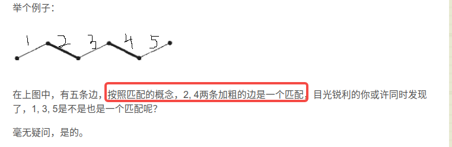
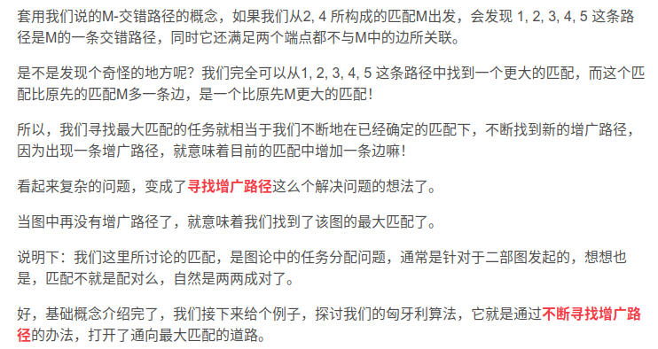
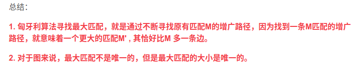

# Hungarian
## 概念
### [参考1](https://blog.csdn.net/u013384984/article/details/90718287)

- 匹配M：是边的集合，边没有公共顶点
- 最大匹配：即边最多的匹配->不能完全完全地匹配，只能最大可能的匹配，这就叫最大匹配；完美匹配一定是最大匹配，但最大匹配不一定是完美匹配
- 交错路径：给定图G的一个匹配M，如果一条路径的边交替出现在M中和不出现在M中，我们称之为一条<u>M-交错路径</u>。
- M-增广路径: 而如果一条M-交错路径，它的**两个端点都不与M中的边关联**，我们称这条路径叫做<u>M-增广路径。</u> [增广路-百度百科](https://baike.baidu.com/item/%E5%A2%9E%E5%B9%BF%E8%B7%AF/1332250)
- 

- 

------

### 参考2

-----

- 匹配M -> 寻找新的增广路径 -> 新匹配
