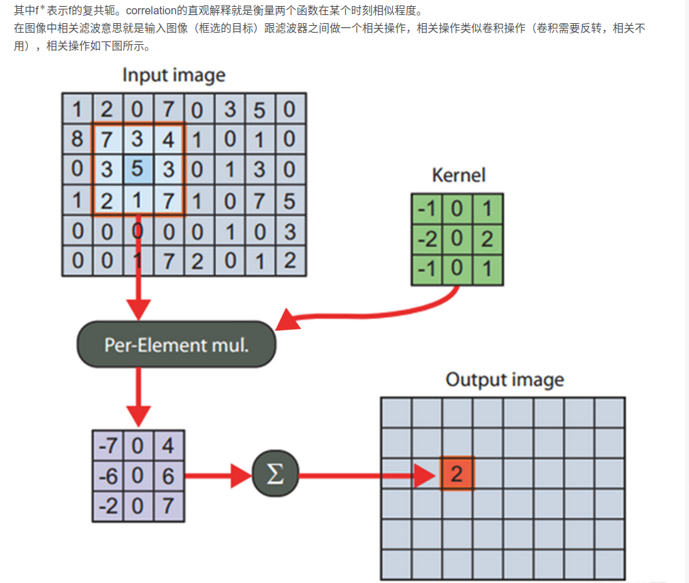
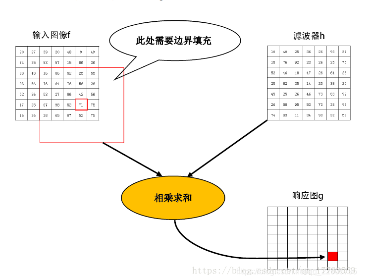
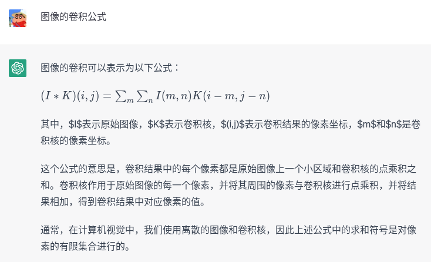
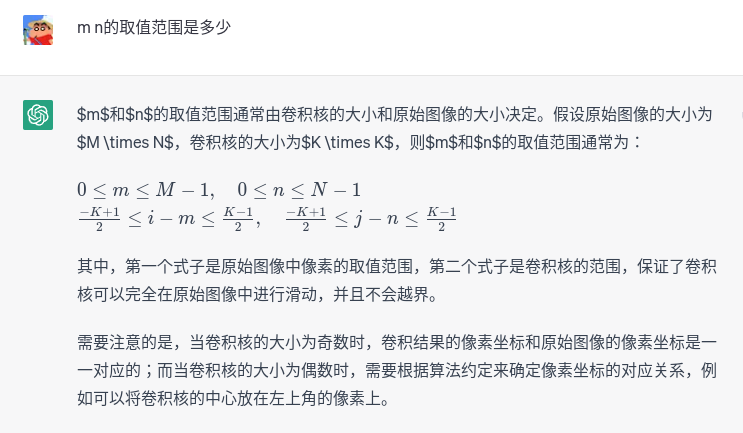
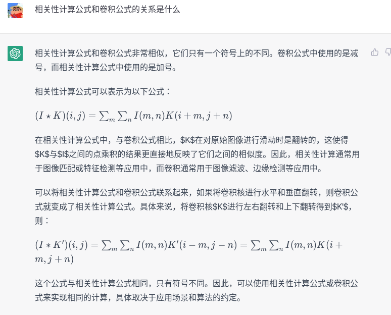
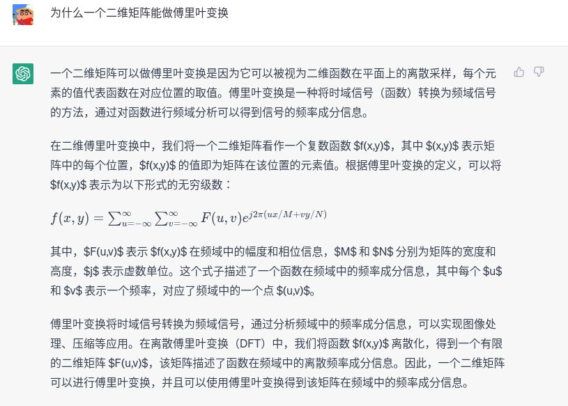

# algorithms

- CSK

- 算法分类
  - 经典算法：
    - MOSSE 
      - <https://blog.csdn.net/qq_22905795/article/details/97272882>
      
      - 
      
        
      
      - 是基础算法
      
      - 相关性滤波操作：两个信号卷积结果数值越大越相关 MOSSE applies this idea to train a filter ht , which could obtain the response map gt when the object image ft and the filter ht are under correlation filtering operation. The highest value in the response map gt indicates the center of the object
      
    - discriminative correlation filter（相关滤波器） based trackers.
        * The discriminative correlation filter based trackers view tracking as a classification problem
        
    - kernel correlation filter based trackers. 
        * the kernel correlation filter based trackers view tracking as a ridge regression problem.
    
  - 基于学习 

QA：
- 图像的卷积是什么？
  （下面图像中的相关性计算公式有错误的）

- 为什么二维矩阵能做傅里叶变换

- https://www.zhihu.com/tardis/zm/art/54946461?source_id=1005