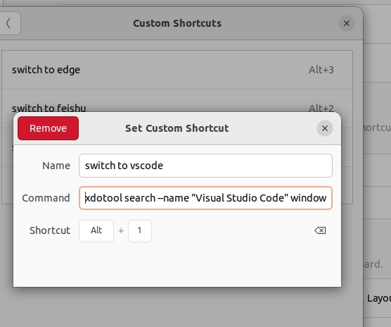

# key map


先装xdotool




```shell
xdotool search --name "Visual Studio Code" windowactivate

xdotool search --name "飞书" windowactivate


```

获取程序名称对应的窗口名称：cmd中

```
xdotool search --class "Bytedance-feishu" getwindowname
```


