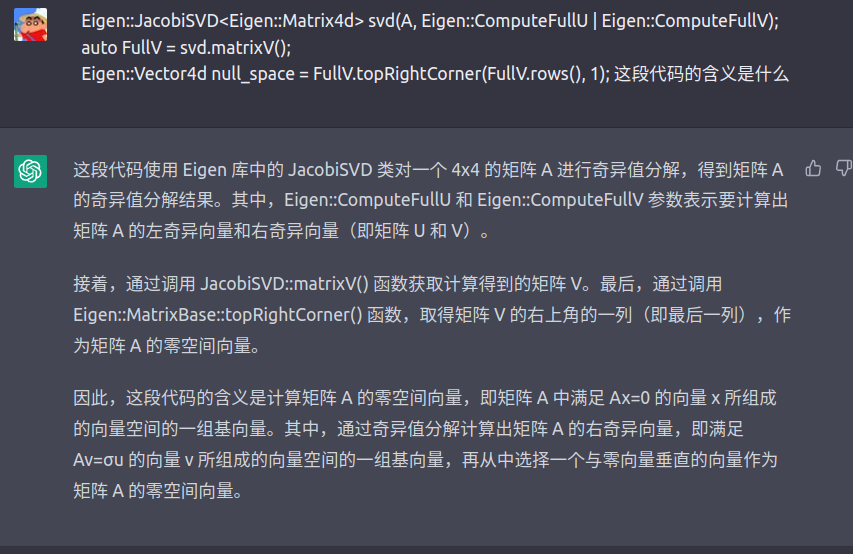
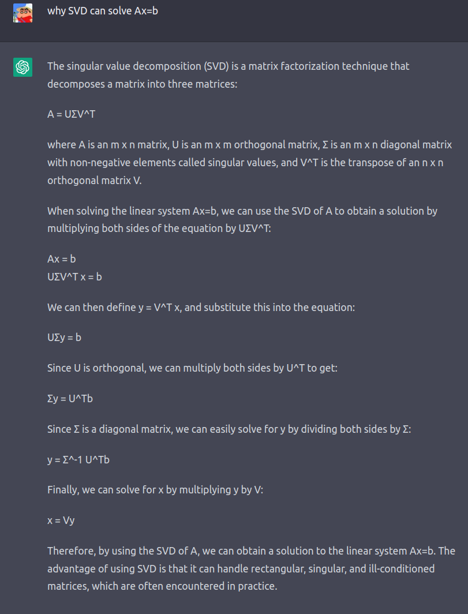
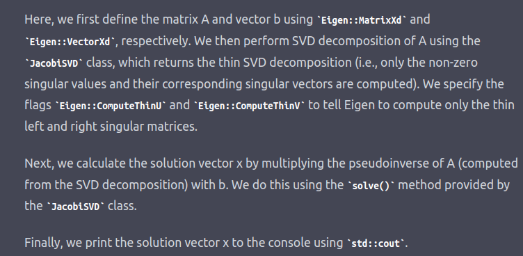

求解Ax=0的部分：



svd分解的结果是什么？



chatgpt给的代码:

```
#include <iostream>
#include <Eigen/Dense>

int main()
{
    // Define the matrix A and vector b
    Eigen::MatrixXd A(3, 3);
    Eigen::VectorXd b(3);
    A << 1, 2, 3,
         4, 5, 6,
         7, 8, 10;
    b << 3, 6, 9;

    // Perform SVD decomposition of A
    Eigen::JacobiSVD<Eigen::MatrixXd> svd(A, Eigen::ComputeThinU | Eigen::ComputeThinV);

    // Calculate the solution vector x
    Eigen::VectorXd x = svd.solve(b);

    // Print the solution vector x
    std::cout << "The solution is:\n" << x << std::endl;

    return 0;
}
```


