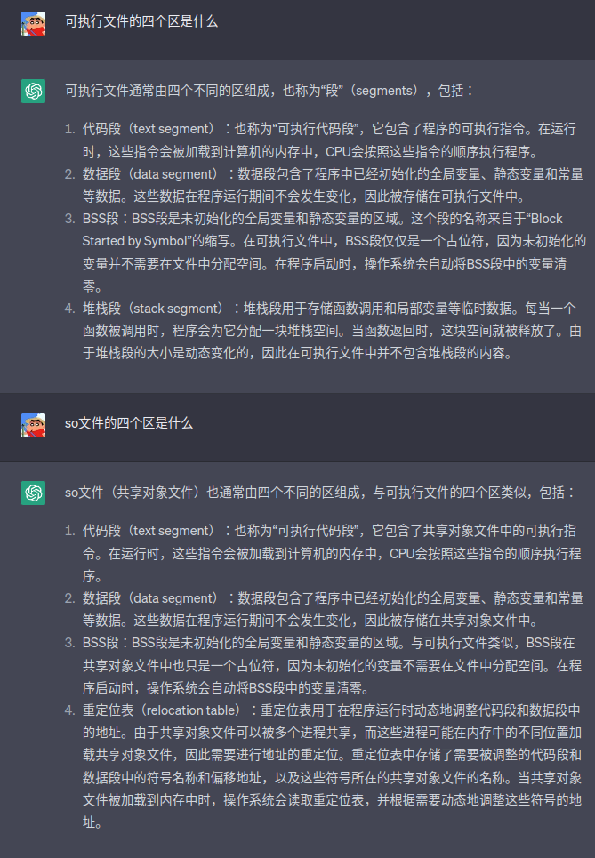

- 定义了析构函数， 要禁用一些构造函数

```c++
class NonCopyable
{
public:
    NonCopyable() = default;
    virtual ~NonCopyable() = default;
    NonCopyable(NonCopyable const&) = delete;
    NonCopyable& operator =(NonCopyable const&) = delete;
    NonCopyable(NonCopyable&&) = delete;
    NonCopyable& operator=(NonCopyable&&) = delete;
};


```

- so文件的四个区

  
