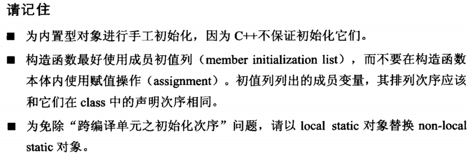
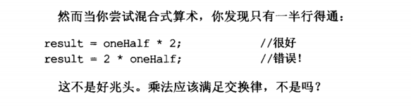

# Effective C++


## 第一章 习惯C++

### 条款1： 视C++为一个语言联邦

### 条款2: 尽量用const enum inline 代替 #define

- 编译器代替预处理器
- 常量通常定义在头文件内
- class的专属常量：
    - 保证其作用阈只在class内，将其作为成员
    - 确保只有一份常量， 设其为static
    - ```c++
      // 头文件
      class A{
        private:
            static const int num = 10;
            int scores[num];
      }
      // cc文件
      const int num; // 可以不用初值，因为声明式中已经给了, "in class 初值设定"；// 只要不取这个常量的地址，可以只声明而无需提供定义
    
    
    - 如果编译器不允许`in class 初值设定`，但是数组声明中又要用这个值，此时可以用'enum hack'
        - ```c++
        class A{
            private:
                enum {Num = 5}; // 事实上这个是模板元编程的基础技术
                int scoresp[Num];
        }
    
- 注意#define不能用来定义class专属常量，因为其不关注作用域

### 条款3： 尽可能使用const

- 

- 

- 

- 将`operator*`的**返回值设置为const**，以预防 `==`打成`=`，导致没意义的赋值操作

#### const 成员函数

- 目的
  - 确保成员函数可以作用于const对象
- 理由
  - 使得class的接口比较容易被理解，可以知道哪个函数可以改动<u>对象的内容</u>，而哪个不可以
  - 使得操作**const对象**成为可能
- 两个成员函数如果常量性不同，则可以被重载，这是c++的一个重要特性
- 定义两个版本的函数，避免代码重复
- 用const的函数实现non-const的函数版本， 避免代码重复

### 条款4： 确保对象使用前已经初始化
- 初始化不等于赋值
- 构造函数尽量用初始化列表
- non-local static 对象 -> 写成单例， 用一个类的专属的函数返回对向的引用

- 


## 第二章 构造/析构/赋值

### 条款5: 了解C++默默编写并调用了什么函数
- 没声明的构造函数，编译器会自动声明，当主动调用了的时候，这些构造函数的定义才会被生成

### 条款6: 不使用的函数，明确拒绝编译器
- uncopyable基类， 如果有类继承，则该类的拷贝构造函数也不可被调用

### 条款7: 为多态基类声明virtual析构函数
- 基类如果是non-virtual的析构函数，造成derived没有被释放（用基类指针释放派生类对象时）；
- 如果是virtual的基类析构函数，那么因为虚函数表的存在，析构函数的执行顺序是: 最深层的继承类，再到各个基类的析构函数； 最深层的类的析构函数会调用基类的析构函数， 所以纯虚基类的析构函数必须要有定义式！
- 每个类都有一个虚函数表，每个类对象都有一个指向这个虚函数表的指针


### 条款8： 别让异常逃离析构函数


### 条款9： 不在构造和析构函数中调用virtual函数
- 在base class 构造期间， 虚函数不是虚函数
- 基类构造函数的调用要早于派生类的构造函数

### 条款10： 令operator=返回*reference to \*this*
- 实现连锁赋值

### 条款11： 在operator= 中处理自我赋值

- 

- 

### 条款12： 复制对象时勿忘其每一个成分

- 

- 

- 无聊嘛 别尝试

  


## 第三章 资源管理

用过的资源必须还给系统


### 条款13： 以对象管理资源

- 两个关键用法
  - 获得资源后立刻放进管理对象
  - 管理对象运用析构函数确保资源被释放

- auto_ptr虽然不再使用了，可以了解一下：这是个类指针的东西，不能让多个auto_ptr指向同一个对象，否则对象被删除一次以上就会出现double free； 通过拷贝构造函数和赋值构造函数复制他们时，它们会变成null，而复制所得的指针将获得资源的唯一拥有权

- auto_ptr的替代方案是引用计数型智慧指针RSCP

- 

### 条款14： 在资源管理类中小心copying行为

- RAII : 资源取得时机便是初始化时机 **Resource Acquisition Is Initialization** 


### 条款15：在资源管理类中提供对原始资源的访问


### 条款16：new和delete成对使用

- 注意数组delete要 delete[]


### 条款17：以独立语句将newed对象置入智能指针

- 

---


## 第四章 设计与声明


### 条款18： 让接口容易被正确使用，不易被误用

- 

### 条款19： 设计class像设计type(内置类型)

### 条款20： 用引用传递代替值传递

- 避免切片
- 避免拷贝

### 条款21： 必须返回对象时，别妄想返回其引用

### 条款22： 将成员变量声明为private


### 条款22： 宁用non-member, non-friend函数替换member函数

- 

- 

- 

- 

- 

### 条款24： 若所有参数皆需类型转换，请为此采用非成员函数

- 

- 

### 条款25： 考虑写出一个不抛异常的swap函数

- 


- 内置类型的交换 不会抛出异常
- 这个条款可以再仔细看看

- <u>函数模板是不支持偏特化的</u>

  - https://zhuanlan.zhihu.com/p/268600376

  - 1. 使用仿函数代替， 借助类模板偏特化

    2. 标签分发

    3. c++20 concept

       
  - https://www.cnblogs.com/zhoug2020/p/6581477.html

## 第五章 实现