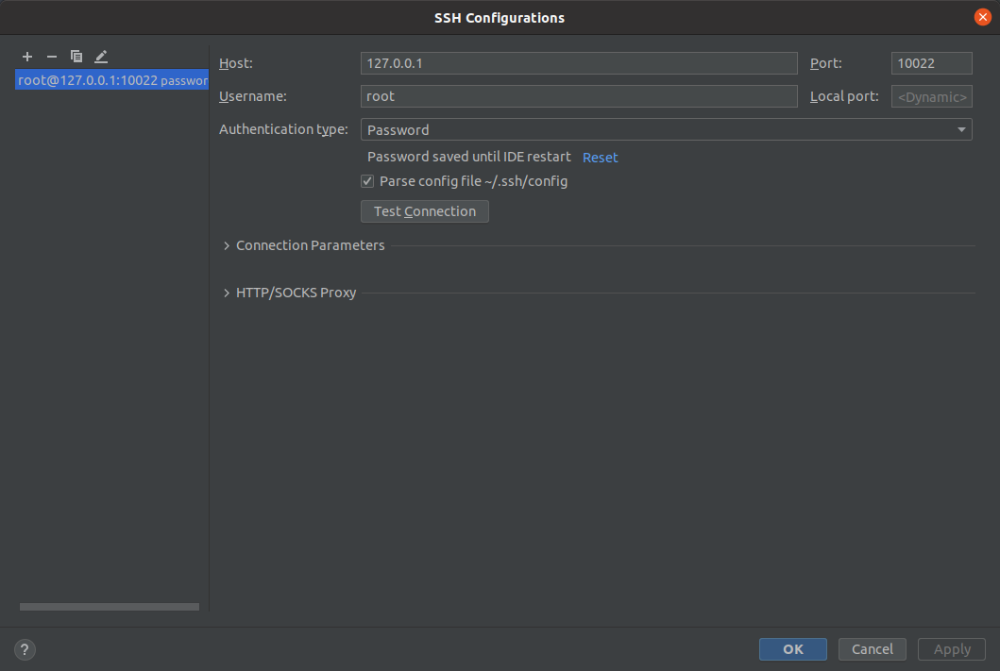

## 破解版
<https://www.cnblogs.com/kohler21/p/17111018.html>
## 如何连接到docker内部进行开发
- docker 内部打开服务
``` shell
wm_sshd: aliased to [[ `passwd -S | cut -b 6` == P ]] || passwd;service ssh restart
```
- ssh连接docker
``` shell
ssh -p 10022 root@{ip}
如： ssh -p 10022 root@127.0.0.1
```

## clion设置
一些参考： <https://zhuanlan.zhihu.com/p/429270402>

- 设置ssh:


