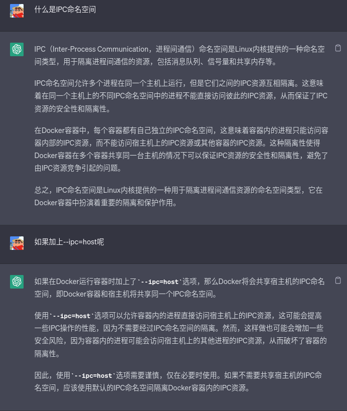
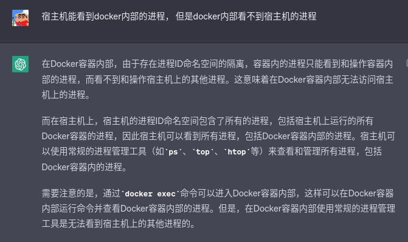
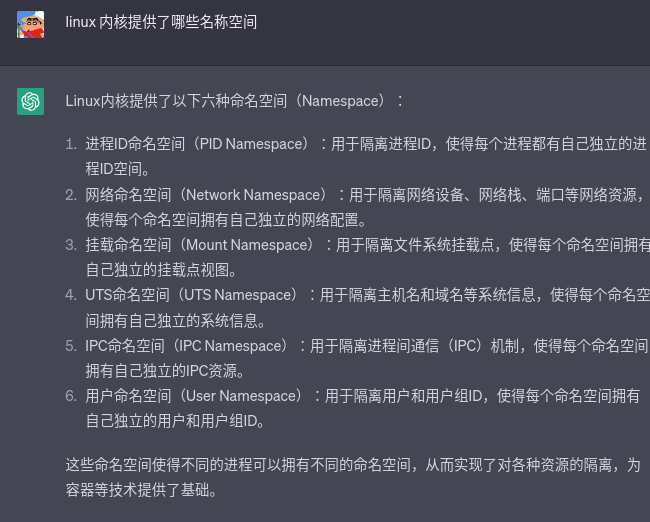

# Docker

## 电子书

<https://yeasy.gitbook.io/docker_practice/>

### 容器
- --privileged 
    - 使用该参数可以使得docker内的用户获得真正的root权限
- xhost+ 
    - 获取x-server的权限
- --ipc=host 
    
    - 是一个启动容器时可以使用的选项，它表示容器将与主机共享进程间通信（IPC）命名空间。
    - 
    
- 进程PID不同
    - Q：同一个进程， 为什么宿主机内的进程id和外部看到的是不一样的
    - A：在Docker容器中运行的进程与宿主机上运行的进程具有不同的进程ID（PID），这是由于Docker使用了Linux内核的命名空间（Namespace）技术。命名空间是Linux内核提供的一种隔离机制，它可以将一组系统资源（例如进程、网络接口、文件系统、IPC等）封装到独立的命名空间中。Docker使用了多种命名空间来隔离容器内的进程和宿主机上的进程，这些命名空间包括PID命名空间、网络命名空间、挂载命名空间、IPC命名空间和UTS命名空间等。当Docker容器中的进程启动时，Docker会创建一个新的PID命名空间，并在其中运行该进程，因此在Docker容器内部看到的进程ID是相对于该命名空间的，而不是宿主机上的进程ID。在宿主机上，Docker会为每个容器创建一个独立的命名空间，并将容器中运行的进程隔离在这个命名空间中，因此在宿主机上看到的进程ID与Docker容器内部看到的进程ID是不同的。总之，由于Docker使用了命名空间技术来隔离容器内和宿主机上的资源，因此同一个进程在宿主机内和外部看到的进程ID是不同的。
    
    - 
    
    - 