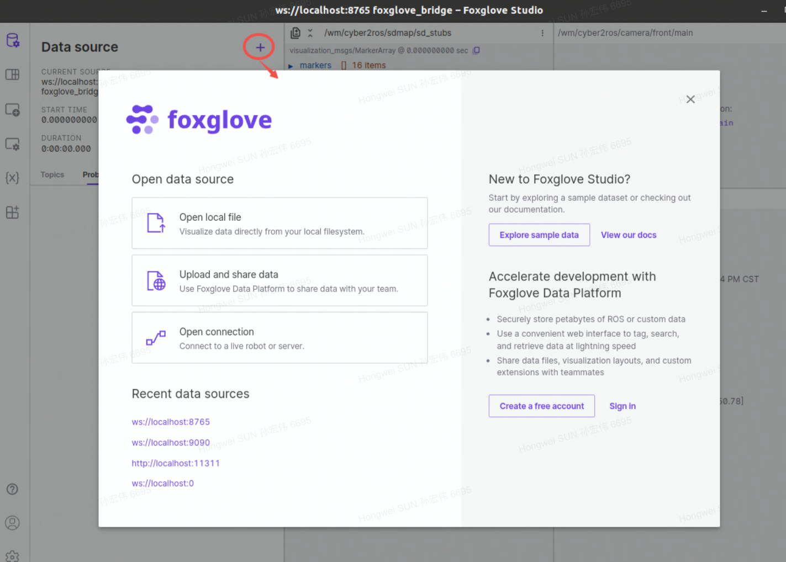
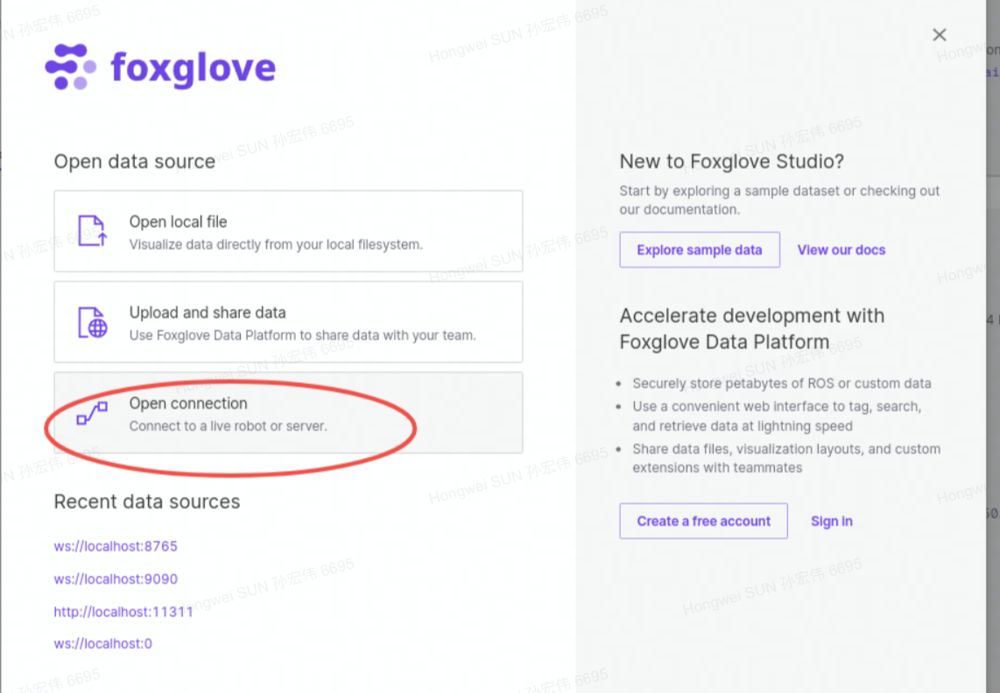
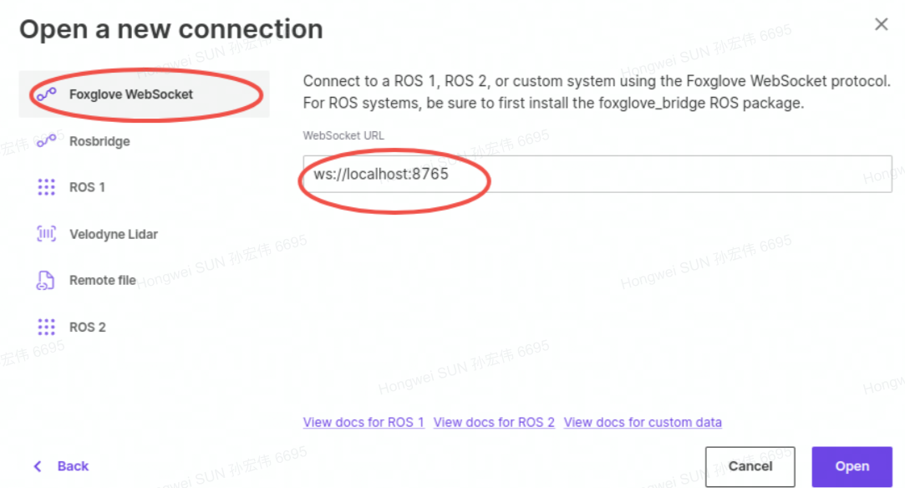
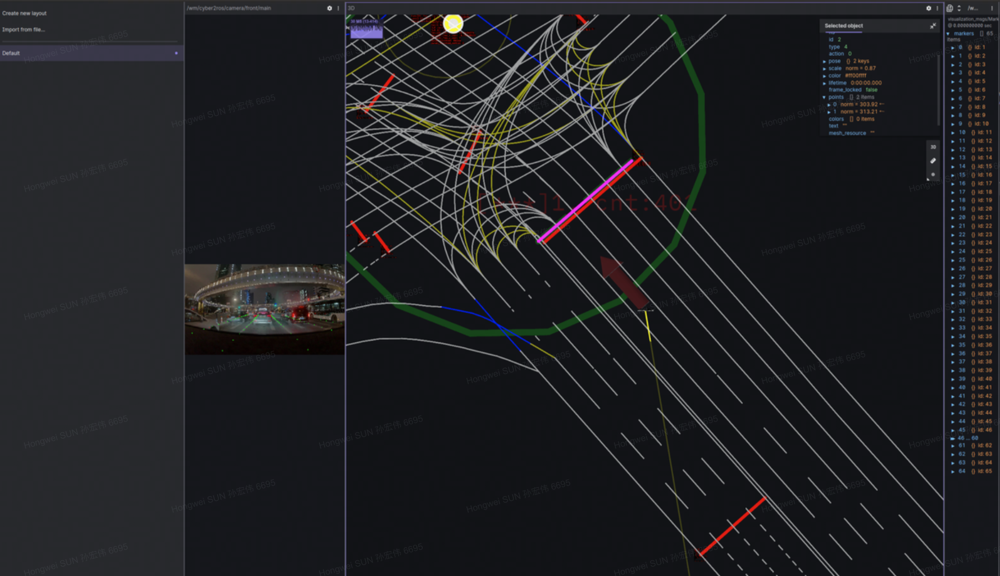

# Foxglove-studio连接wm-docker
## docker内外：
在docker内外的.bashrc中加入以下两行：
```
export ROS_MASTER_URI=http://$(hostname --ip-address):11311
export ROS_HOSTNAME=$(hostname --ip-address)
```
## docker外部执行以下操作
1. 安装本地foxglove-studio
https://foxglove.dev/download
2. 安装bridge
https://foxglove.dev/docs/studio/connection/using-foxglove-bridge
3. 运行bridge
rosrun foxglove_bridge foxglove_bridge
4. 打开foxglove-studio，连接到ros1







## 效果

