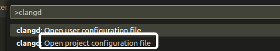
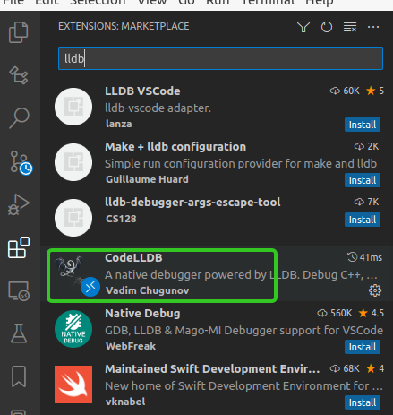
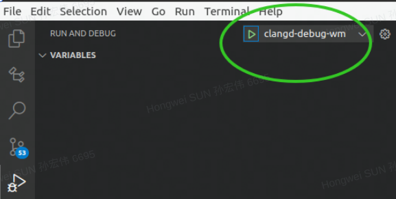

# Clangd

## 先安装clang
```
sudo apt install clang
```

## 配置文件

### 系统用户级别

配置文件为 `~/.config/clangd/config.yaml`

```
Diagnostics:
  ClangTidy:
    Add:
      [
        performance-*,
        bugprone-*,
        portability-*,
        modernize-*,
        google-*
        misc-*
        cppcoreguidelines-*
        -Wno-documentation
        -std=c++17 
      ]
    Remove:
      [
        modernize-use-trailing-return-type,
        modernize-use-nodiscard
      ]
    CheckOptions:
      WarnOnFloatingPointNarrowingConversion: false
Index:
  Background: Build

```

### 项目级别



## vscode setting文件中的配置参数

```
	///--------------- clangd
	"clang-format.fallbackStyle": "google",
	"clangd.path": "/root/.vscode-server/data/User/globalStorage/llvm-vs-code-extensions.vscode-clangd/install/15.0.6/clangd_15.0.6/bin/clangd",
	"clangd.arguments": [
		// "--compile-commands-dir=/root/world_model/build-clangd/",
		"--compile-commands-dir=${workspaceFolder}/build-clangd/",
		"--background-index",
		"--completion-parse=auto",
		// When disabled, completions contain only parentheses for function calls.
		// When enabled, completions also contain placeholders for method parametersPcmake
		"--function-arg-placeholders=true", // 用tab切换
		"--header-insertion-decorators", // 用圆点区分头文件是否已经插入
		"-j=8",
		"--query-driver=/usr/bin/g++", // 取决于configure的时候用什么编译器
		"--clang-tidy",
		"--fallback-style=Google",
		"--header-insertion=iwyu",
		"--pch-storage=memory",
		"--pretty",
		"--ranking-model=heuristics",
		"--enable-config",
		"--all-scopes-completion", // 全代码库补全
		"--completion-style=bundled", // 详细补全
	],
	"clangd.onConfigChanged": "restart",
	"clang.completion.completeMacros": false,
	// "clang.completion.enable": false,
```


## LLDB调试代码

### cmakelists

代码编译的是debug版本；cmakelists中加入：

```cmake
#  for debug
set(CMAKE_CXX_FLAGS
 "${CMAKE_CXX_FLAGS} -std=c++17 -pipe -O -Wall -g  -Wfatal-errors -fopenmp  -fPIC -pthread "
  )
  
SET(CMAKE_BUILD_TYPE "Debug")
SET(CMAKE_C_FLAGS_DEBUG "$ENV{CFLAGS} -O0 -Wall -g -ggdb")
SET(CMAKE_C_FLAGS_RELEASE "$ENV{CFLAGS} -O3 -Wall")
SET(CMAKE_CXX_FLAGS_DEBUG "$ENV{CFLAGS} -O0 -Wall -g -ggdb")
SET(CMAKE_CXX_FLAGS_RELEASE "$ENV{CFLAGS} -O3 -Wall")
```

// 下面的不再维护， 请vscode文件夹下面的配置

### tasks.json文件

这个task就是通过运行run_wm.sh脚本载入了一些环境变量

```json
{
    "tasks": [
        {
            "type": "shell",
            "label": "run_wm_env",
            "command": "source",
            "args": [
                "/root/.vscode/run_wm.sh"
            ]
        }
    ],
    "version": "2.0.0"
}
```

run_wm.sh文件如下：

```Shell
#!/bin/bash
export GLOG_minloglevel=1
# export GLOG_v=5
# export GLOG_logtostderr=0
export GLOG_alsologtostderr=1
export GLOG_log_dir=./logs/

export LD_LIBRARY_PATH=/opt/ros/noetic/lib/
export LD_LIBRARY_PATH=/integration/lib:$LD_LIBRARY_PATH

export PATH=$PATH:/integration/bin
export CYBER_PATH=/integration
export CYBER_IP=127.0.0.1
export TERMINFO=/usr/share/terminfo
export TERM=xterm-basic

cp /integration/conf/pnc/etc/worldmodel/config/worldmodel_test.conf /integration/conf/pnc/etc/worldmodel/config/worldmodel.conf
 
# [deprecated] LD_PRELOAD=/integration/lib/libmapmodule.so /integration/bin/mainboard -d /integration/conf/pnc/etc/worldmodel/dag/worldmodel.dag
# gdb --args /integration/bin/mainboard -d /integration/conf/pnc/etc/worldmodel/dag/worldmodel.dag
# /integration/bin/mainboard -d /integration/conf/pnc/etc/worldmodel/dag/worldmodel.dag
echo "debug wm code"
```


### launch.json文件

```json
// launch.json
{
    "version": "0.2.0",
    "configurations": [
        {
            "name": "clangd-debug-wm",
            "type": "lldb",
            "request": "launch",
            "program": "/integration/bin/mainboard",
            "args": [
                "-d",
                "/integration/conf/pnc/etc/worldmodel/dag/worldmodel.dag"
            ],
            "cwd": "${workspaceFolder}",
            "sourceLanguages": [
                "C++"
            ],
            "stopOnEntry": false,
            "preRunCommands": [],
            "preLaunchTask": "run_wm_env",
            "terminal": "integrated", // "integrated", "external", "console", 
            "env": {
                "GLOG_minloglevel": "1",
                "GLOG_alsologtostderr": "1",
                "GLOG_log_dir": "/root/world_model/logs",
                "LD_LIBRARY_PATH": "/integration/lib/:/opt/ros/noetic/lib/",
                "PATH": "$PATH:/integration/bin",
                "CYBER_PATH": "/integration",
                "CYBER_IP": "127.0.0.1",
                "TERMINFO": "/usr/share/terminfo",
                "TERM": "xterm-basic",
            },
        }
    ]
}
// https://github.com/vadimcn/vscode-lldb/blob/v1.7.0/MANUAL.md
```

### vscode的lldb插件

vadim Chugunov开发的~



### 打断点调试




## 参考链接

[https://clang.llvm.org/get_started.html](https://clang.llvm.org/get_started.html)

[一个vscode下的使用教程](https://zsien.cn/vscode-uses-clangd-to-provide-intellisense-and-autocomplete/)