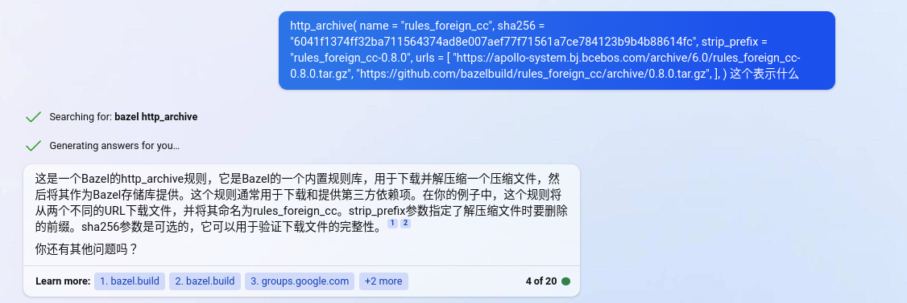

- load函数是干嘛用的？

- bazel-tools
@bazel_tools//tools/build_defs/repo 是一个Bazel的内置规则库，它包含了一些常用的规则，例如http_archive和git_repository等。这个文件夹位于Bazel的安装目录下，通常是在$HOME/.cache/bazel/bazel$USER/安装版本号/external/bazel_tools/tools/build_defs/repo目录下。1

- http - archieve

  

- 怎么生成compilec-command-json文件
  - <https://github.com/kiron1/bazel-compile-commands>
  - compile_commands.json 文件是一个包含了编译命令的JSON格式的文件，它可以用于一些工具，比如 Clang Tools 或 RTags 等。Bazel 本身不提供生成 compile_commands.json 文件的功能，但是你可以使用一些第三方的工具来实现。比如：
    - kiron1/bazel-compile-commands: 一个可以在不修改 Bazel 配置文件的情况下生成 compile_commands.json 文件的工具
    - hedronvision/bazel-compile-commands-extractor: 一个可以集成到 Bazel 文件中的工具，使用 Bazel action listeners 来获取编译命令。
    - grailbio/bazel-compilation-database: 一个提供了一个 Bazel 规则和一个脚本来生成 compile_commands.json 文件的工具。你可以根据你的需求和喜好选择其中一个工具来使用。

  - 选择kiron1的工具， <https://github.com/kiron1/bazel-compile-commands/releases/tag/v0.5.0> 下载deb文件， 然后运行命令即可； 之后就可以结合clangd进行代码提示了
