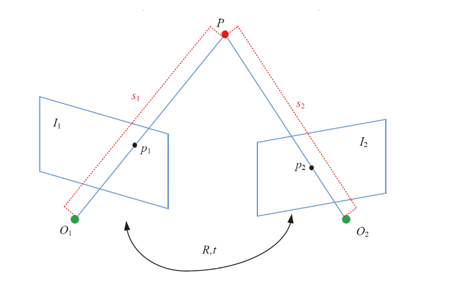

# Title

## what

三角测量（[Triangulation](https://en.wikipedia.org/wiki/Triangulation)）又叫三角化，是根据前后两帧图像中匹配到的特征点像素坐标以及两帧之间的相机运动**R**、**t**，计算特征点三维空间坐标的一种算法。

示意图：

上图中的R和t的表达和我平时理解的R和t一样， 我平时理解的是先平移再旋转； 点在旧坐标系下的坐标等于T乘以在新坐标系下的坐标：

$$
p_{old} = T p_{new}
$$

假设坐标系1平移t得到了坐标系2，坐标系2旋转一个角度到坐标3，然后：

$$
p_1 = p_2 + t = Rp_3+t
$$

ok， 接下来理解对极约束；

内参矩阵 $K$反映了3D世界中的点的关系映射到相机2D平面坐标系的关系：

$$
Z p_{uv} = KP_{world}
$$

对于上图中的第一个坐标系，真实世界中的$P$点被相机1捕捉采集到了相机坐标$x_1$, 得到：

$$
Z_1 p_{uv1} = K P_{world}
$$

反之如果我们知道了相机上的坐标$p_{uv1}$, 反推$p_{w1}$点坐标为：

$$
P_{w1} = Z_1K^{-1}p_{uv1}
$$

其中， $Z1$表示深度值带来的比例，这个值目前不确定；

同理，相机2也是对3D点有捕捉的，由它的像素坐标可以反推出3D世界点的坐标为:

$$
P_{w2} = Z_2 K^{-1}p_{uv2}
$$

当然$P_{w2}$是在相机2的坐标系下的，假设深度都是1， 那么令两个像素点对应的3D点(即为皈归一化平面上的坐标点)为:

$$
\left\{
		\begin{aligned}
			x_1 = K^{-1}p_{uv1} \\
			x_2 = K^{-1}p_{uv2}
		\end{aligned}
	\right.
$$

且：

$$
\left\{ 
	\begin{aligned} 
		P_{w1} = s_1 x_1 \\ 
		P_{w2} = s_2 x_2 
	\end{aligned}
\right.
$$

那么我们需要把两个反推的点都对齐到相机1坐标系下, 满足关系：

$$
P_{w1} = RP_{w2} + t
$$

代入$x_1, x_2$:

$$
s_1 x_1 = s_2 R x_2 + t \tag{1}
$$

公式(1)即为对极约束;

then:

两边同时叉乘$x_1$：

$$
s_1 x_1 \times x_1 = 0 = s_2 R x_1 \times x_2 + x_1 \times t \tag{2}
$$

根据上式(2)的右边可以计算$s_2$, 继而根据公式(1)可以计算$s_1$; 这样就知道了$P_{world}$

在两个相机中的深度，之后就可以计算出两个相机计算出的3D位置点；

实际上公式（2)是不严格为0的，计算出来的两个点是存在误差的，这时候就需要最小二乘解；

## 参考链接

1. [多视图三角化](https://gutsgwh1997.github.io/2020/03/31/%E5%A4%9A%E8%A7%86%E5%9B%BE%E4%B8%89%E8%A7%92%E5%8C%96/)
2. [古月居三角化](https://www.guyuehome.com/35452)
